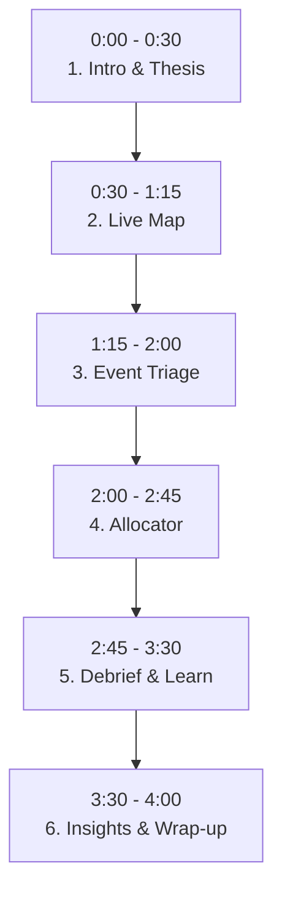

# 🎬 PRAHARI — Demo Video Recording Script

This script is structured for a **3 to 4-minute demo video** suitable for Flipkart GRiD judges. It takes the viewer through the logical flow of the system: **Introduction ➔ Predict ➔ Deploy ➔ Learn ➔ Data Evidence**.

---

## ⚙️ Pre-Recording Checklist

1. **Clean Screen:** Close all irrelevant browser tabs, applications, and mute notifications.
2. **Full Screen:** Press `F11` in your browser to go full screen on the app (`http://localhost:5173`).
3. **Warm-Up:** Ensure both backend and frontend servers are running, and open the pages once beforehand to ensure images and map assets are fully cached by the browser.
4. **Recording Tool:** Use OBS Studio, Xbox Game Bar (`Win + G`), or Loom to record in high definition (1080p).

---

## 🎙️ Video Timeline & Script

### 1. Introduction & Core Thesis (0:00 - 0:30)
* **Visual:** Open on the **Home / Landing Page** of PRAHARI. Slowly hover over the three core pillars cards: **PREDICT**, **DEPLOY**, and **LEARN**.
* **Voiceover:**
  > *"Hello judges, today we are showcasing PRAHARI, our solution for Flipkart GRiD Lock 2.0. Bengaluru's traffic is reactive and lacks foresight when events happen. PRAHARI introduces three critical layers: Predict, to assess event impacts in real-time; Deploy, to optimize officer dispatch; and Learn, to continuously retrain our models using closed incident data."*

---

### 2. PREDICT: Live Map & Real-time Visualization (0:30 - 1:15)
* **Visual:** Click on **Predict Live Map** in the navbar. Zoom out slightly and pan around to show the density heatmap. Hover over a couple of traffic event pins to display the tooltip with their **Event Impact Score (EIS)** and details.
* **Key Action:** Notice the page loads instantly. Highlight this speed.
* **Voiceover:**
  > *"First, let's look at the Live Map. Here, we ingest and map active traffic events in real-time. By leveraging optimized vectorized batch ML scoring, we calculate the Event Impact Score, or EIS, and estimate durations for hundreds of concurrent events in milliseconds. The heatmap reveals spatial density hotspots, letting officers spot where congestion is clustering instantly."*

---

### 3. PREDICT & DEPLOY: Event Triage Form (1:15 - 2:00)
* **Visual:** Click **Event Triage** in the navbar. Fill out a sample event:
  * **Event Cause:** `vehicle_breakdown` (or select from dropdown)
  * **Location:** Select a busy area/junction (e.g. `Hebbal Junction`)
  * **Hour:** `18:00` (Peak evening hour)
  * Click **Calculate EIS**. Show the results panel that appears on the right.
* **Voiceover:**
  > *"When a new incident is reported, dispatchers use our Event Triage tool. By inputting the cause, location, and time, our backend computes the EIS score and predicted clearance time. It also generates tailored response blueprints—recommending the specific number of officers, barricade layouts, and routing diversions dynamically based on the severity of the event."*

---

### 4. DEPLOY: Concurrent Resource Allocator (2:00 - 2:45)
* **Visual:** Click **Concurrent Allocator** in the navbar.
  * Adjust the **Available Officers** slider to a low number (e.g., `12`).
  * Click **Run Allocator**.
  * Point out how the system ranks the active events by EIS and distributes the limited officer resources to the most critical locations first.
* **Voiceover:**
  > *"In a real city, traffic police stations face resource constraints. In our Concurrent Allocator, we can simulate an officer shortage. When we run the allocator, the system performs a greedy optimization—automatically ranking incidents by their EIS and dispatching our limited officers to the highest-impact situations first, preventing chaotic bottlenecks before they escalate."*

---

### 5. LEARN: Post-Event Debrief & Feedback Loop (2:45 - 3:30)
* **Visual:** Click **Post-Event Debrief** in the navbar.
  * Pick an active event from the list.
  * Input the **Actual Duration** (make it slightly different from predicted to show the learning curve, e.g. if predicted is `45 mins`, set actual to `35 mins`).
  * Click **Submit Debrief & Retrain**.
  * Watch the model retrain in real-time (~3-5 seconds) and highlight the **Mean Absolute Error (MAE)** chart updating.
* **Voiceover:**
  > *"Unlike traditional static systems, PRAHARI learns. When an event is resolved, officers submit a quick post-event debrief. By feeding this ground-truth data back to our server, the system automatically retrains our machine learning models incrementally. As you can see on the MAE chart, our error rate decreases over time, sharpening all subsequent predictions."*

---

### 6. Insights & Wrap-up (3:30 - 4:00)
* **Visual:** Click **Insights** in the navbar. Scroll down slowly, showing the interactive charts (peak hours, spatial grid distributions, cause impact analysis).
* **Voiceover:**
  > *"Every single feature in PRAHARI is backed by data. In our Insights dashboard, we visualize patterns from the 8,173 ASTraM events we analyzed—validating our spatial grids, peak hour fingerprints, and event durations. PRAHARI builds a proactive, optimized, and learning ecosystem for Bengaluru's traffic. Thank you."*

---

## 💡 Pro Tips for a Great Demo

* **Slow down your cursor:** Do not make fast or jerky mouse movements. Move your mouse deliberately to draw attention to buttons or charts before clicking them.
* **Let the page breathe:** When clicking a tab or submitting a form, wait 1-2 seconds before speaking so the viewer can absorb the new UI state.
* **Hide the URL bar:** Pressing `F11` (Full Screen) hides the browser URL bar and bookmarks, making the video look clean, professional, and product-focused.
